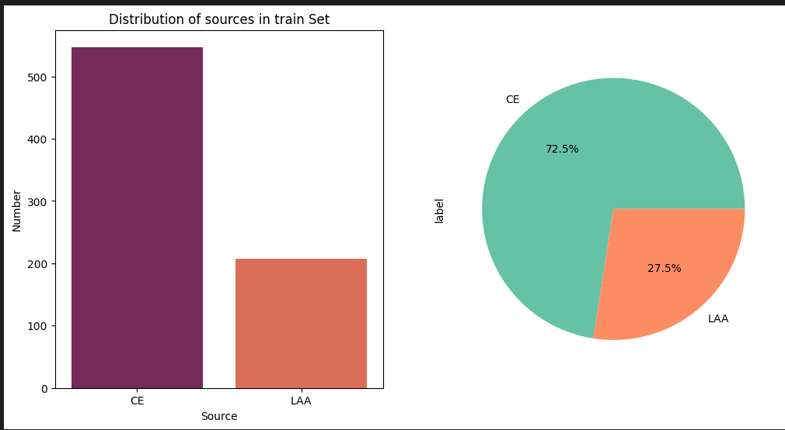
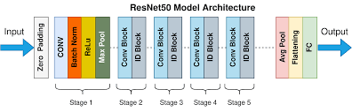
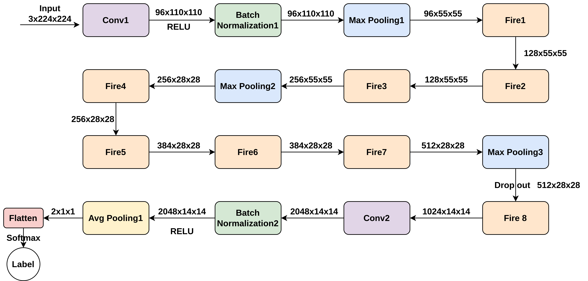
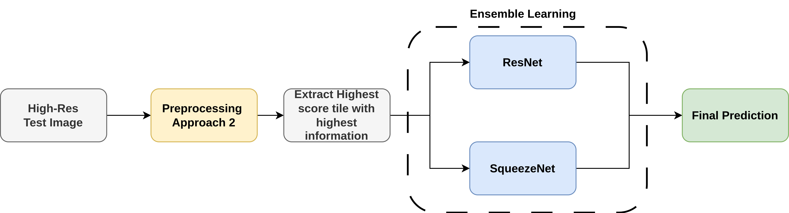

# Image Classification of Stroke Blood Clot Origin

## Table of contents:

- [Overview](#overview)
- [Data](#data)
- [Model Stucture](#model-structure)
- [Results](#results)
- [Project Structure](#project-structure)
- [Team](#team)

### Overview
Problem related to [STRIP-AI](https://www.kaggle.com/competitions/mayo-clinic-strip-ai) competition, to classify the blood clot origins in ischemic stroke. Using whole slide digital pathology images to differentiates between the two major acute ischemic stroke (AIS) etiology subtypes: cardiac and large artery atherosclerosis (CE - LAA).
### Data
 [The data](https://www.kaggle.com/competitions/mayo-clinic-strip-ai/data) comprises 754 high-resolution whole-slide digital pathology images in TIF format, categorizing stroke origin as either CE or LAA , but have size variations and the distribution of the classes is not balanced that need careful handling.
  <p align="center">
  
</p>
 To tackle the challenges of limited, imbalanced, and variable-sized stroke clot images, we leveraged data augmentation. 
 <p align="center">
  
</p>
 effectively balancing the dataset and boosting training data volume( 4313 final images).


### Model Structure
Ensemble learning between ResNet and SqueezeNet
1. ResNet50 Model:

<p align="center">
  
</p>

1. SqueezeNet Model:

<p align="center">
  
</p>

Test Pipeline for one test image:
<p align="center">
  
</p>

### Results

### Project Structure

```
main
├─ Config
├─ data: dir containing 2 data samples
│  ├─  raw : original data
│  ├─  processed: Images Tiles
│  └─  processed-after-removing-low-score-imgs: Tiles after filtering 
├─ models: containing models checkpoints
├─ notebooks
│  ├─  Data Exploring.ipynb
│  ├─  Data Preprocessing Approach 1.ipynb
│  ├─  Data Preprocessing Approach 2.ipynb
│  ├─  EfficientNet_training_kaggle.ipynb
│  ├─  RestNet5_training_kaggle.ipynb
│  ├─  SqueezeNet_training_kaggle.ipynb
│  └─  test-evaluation.ipynb
├─ reports
│  ├─  Paper.pdf
|  └─   figures
├─ src
│  ├─  preprocessing
│  │   ├─  preprocessing_approach_1.py
│  │   └─  preprocessing_approach_2.py
|  ├─  dataloaders
│  │   ├─  Dataloader.py
│  │   └─  Dataloader_with_aug.py
│  └─  models
│      ├─  EfficientNet.py
│      ├─  ResNet50.py
│      ├─  squeezeNet.py
│      └─  helpers
│          └─  FireModule.py
└─ README.md
```


### Team

First Semester - Artificial Neural Networks in Medicine (SBE4025) class project created by:

  | Team Members' Names                                    | Code | 
  | ------------------------------------------------------ | :-----: | 
  | [Ahmed Hassan](https://github.com/ahmedhassan187) |    9202076    |
  | [Habiba Fathallah](https://github.com/Habibafathalla)     |    9202458    |  
  | [Rawan Mohamed](https://github.com/RawanFekry)   |    9202559    |  
  | [Romaisaa Saad](https://github.com/Romaisaa)         |    9202564    |  
### Submitted to:

- Dr. Inas Yassine & Eng. Merna Biabers
  All rights reserved © 2024 to Team 3 - Systems & Biomedical Engineering, Cairo University (Class 2024)
